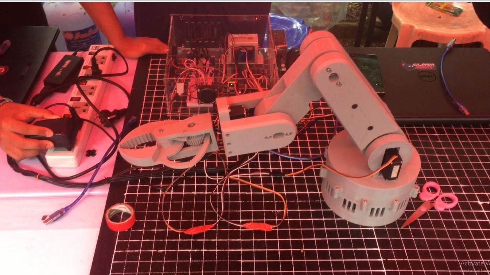

# Robot arm

---

My Fifth year project in WYTU.  
The main function of the robot arm is that it can save the positions user moved and repeat that positions anytime user wants.  
For Wireless Communication, I used nrf module to control this robot arm.   
Feel free to use this repo and upgrade.